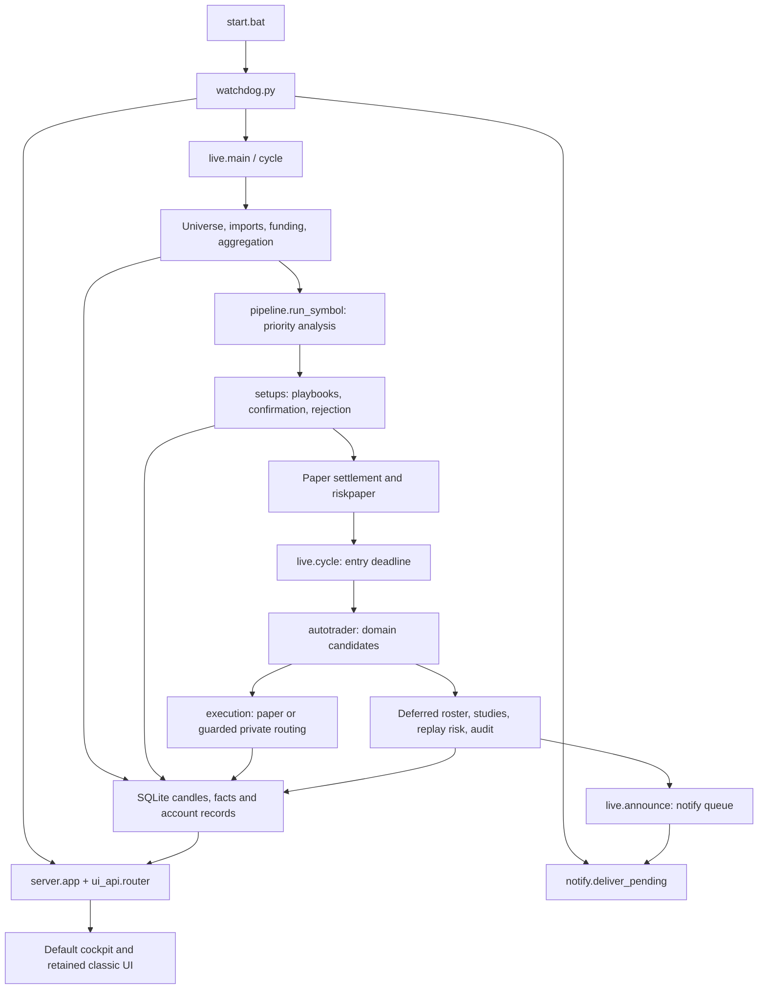

# Authoritative production architecture

Source audit: `acc579f6e8e481839c98dc84d49659f767db2a96`, 2026-09-28.
This is a navigation map, not a replacement for code. Update it when ownership
or wiring changes. The audited implementation is Python/FastAPI with static
JavaScript, not the separate React/CCXT `snipersight-trading` project.

## Execution and dependency map

These arrows distinguish process/data dependencies; API reads do not wait for
notification delivery, and the API is not the scanner's execution dispatcher.
UI actions enter explicit server/account handlers. Private monitoring and
reconciliation also run before entry dispatch when the selected mode or
existing custody requires them. The full function order in `live.cycle` is
authoritative.

## Source-of-truth modules

All engine paths below are relative to `app/engine/`.

| Concern | Authority | Boundary / consumers |
|---|---|---|
| Startup | `app/start.bat`, `app/watchdog.py:main` | Supervisor starts `live.py` and `uvicorn server:app`; run from `app/` |
| Scanner and scheduling | `app/live.py:main`, `cycle`, `next_wake` | Fixed scan cutoff, candle-boundary scheduling, feed pins, priority/deferred phases, account entry deadline |
| Per-symbol engine order | `pipeline.py:PER_SYMBOL`, `_PRIORITY`, `run_symbol` | Shared by live scanner and ingest/backfill; not separate engine implementations |
| Candle/fact persistence | `store.py` | SQLite schema/migrations, Decimal text prices, versioned append-only facts, run provenance |
| Universe and listing policy | `universe.py`, `listings.py`, `venues.py` | New-opportunity eligibility differs from unresolved-order data retention |
| Market imports | `importer.py`, `ingest.py`, `aggregator.py` | Closed candles and 4H/1W rollups; backfill uses the shared pipeline |
| Venue adapters | `phemex.py`, `kraken.py`, Coinbase transport in `importer.py` | Public market data; `binance.py` supplies reference series, not account routing |
| Current price/feed helpers | `marketdata.py`, `funding.py`, `open_interest.py` | OI collection is research and occurs after account dispatch |
| Swings, ATR, tick handling | `swings.py` | Shared primitives; inspect consumers before changing |
| Structure / BOS / CHoCH | `structure.py:run` | Consumes confirmed swing facts |
| Production supply/demand zones | `zones.py:run` | Swing-derived zone anchors and touch/break lifecycle |
| Liquidity pools and sweeps | `liquidity.py:run` | Confirmed pools, sweep facts and target selection inputs |
| Regime and higher-timeframe context | `regime.py`, `bias.py`, `regimeread.py`, `chartread.py` | Distinct structural, phase and visible-chart-window readings; policy application belongs to playbooks |
| BTC alignment research | `btcalign.py` | Research annotation/grading; not a hard BTC impulse gate in this scanner |
| Descriptive indicators | `ma.py`, `momentum.py`, `volatility.py`, `volume.py`, `ranges.py`, `fvg.py`, `volprofile.py`, `sessions.py`, `basis.py` | Collection does not by itself authorize use as a trading gate; volatility is in the priority roster |
| Research order blocks and detector sequences | `research.py`, `researchsignals.py` | Last-opposite-candle order blocks, linked sequences, Stoch RSI/divergence/OI and immutable setup snapshots; not production `zones.py` |
| Playbook catalogue | `registry.py:ALL`, `BY_KEY`, `BY_ENGINE_NAME` | Metadata/contracts for live, measured and planned entries; catalogue presence does not enable execution |
| Production playbook mechanics | `setups.py:playbook`, `confirms`, `run` | Pullback/reversal qualification, confirmation, R:R/cost gates, confluence and rejection facts |
| Scale-in producer | `scalein.py` | Present in replay roster; account routing restrictions remain authoritative |
| Setup lifecycle facts | `setups.py:run` | FORMING, CONFIRMING, VALIDATED and terminal facts |
| Candidate/account presentation | `opportunities.py:lifecycle`, `candidate`, `list_candidates`, `rank`; `contracts.py` | Domain-specific custody/risk overlays, normalized states and immutable plans |
| Rejection authorities | `pipeline.py`, `setups.py`, `risk.py`, `riskpaper.py`, `autotrader.py` | Data gates, strategy rejection, account admission and routing refusal are separate stages |
| Sizing / shared admission math | `risk.py:size_order`, `decide`, `policy_for`; `costs.py`, `venues.py` | Shared calculation authority, not permission to share balances |
| Actual bot paper risk | `riskpaper.py:run`, `paperbook.py` | Uses actual paper account equity/exposure after settlement |
| Historical replay risk | `risk.py:run` | Research replay domain; not the bot paper balance |
| Replay fills / exit math | `execsim.py` | Research execution and shared cost/fill/exit primitives |
| Account dispatcher | `autotrader.py:run` | Eligible READY candidates in the selected domain, mode/admission checks |
| Actual account execution | `execution.py:Coordinator`, `monitor_paper`, `monitor_private` | Durable intent/outbox routing, paper book and private order monitoring |
| Private custody / protection | `positions.py`, `lifecycle.py`, `profit_protection.py` | Reconciliation, closure, protective-order lifecycle; not setup confirmation |
| Phemex private integration | `broker_factory.py`, `phemex_private.py` | Environment-separated credentials and testnet/mainnet transport; mainnet routing remains build-locked |
| Modes, account and settings | `automation.py`, `shared_account.py`, `settings.py`, `credentials.py`, `livegate.py` | Existing mode/promotion/safety contracts; no cleanup changes |
| Manual trades | `manual.py`, server/manual action handlers | Separate manual namespaces and shared-account integration; historical versions may still own open orders |
| Alerts | `app/live.py:announceable/announce`, `app/notify.py`, `app/watchdog.py` | Scanner queues; watchdog delivers. Configured toast, ntfy and generic JSON webhook sinks |
| HTTP entry and action API | `app/server.py` | Root/static routes, unversioned read/action APIs, bridge/access guards |
| Default cockpit read models | `app/ui_api.py` | `/api/ui/v1` router included by `server.py`; also has explicit actions |
| Default frontend | `app/static/cockpit.html`, `cockpit/app.js`, `cockpit/state.js` | Selection/request ordering, cancellation and rendering; also consumes unversioned action APIs |
| Classic compatibility frontend | `app/static/shell.html`, `shell.js`, `ssdata.js` and linked assets | Served at `/classic`, deliberately retained UI rollback; `ssdata.js` owns its shared fetch cache |
| Diagnostics / telemetry | `quality.py`, `runlog.py`, `telemetry.py`, diagnostics/read-model modules | Persisted scanner quality is distinct from request-time diagnostics |
| Housekeeping | `app/prune.py`, supervisor log/heartbeat handling | Scheduled telemetry retention plus explicitly invoked maintenance tools |
| Stocks workspace | `stocks.py`, `stockstore.py`, `stockcalendar.py`, `stockdemo.py` | Separate workspace/store and fixture/provider boundaries; not a second crypto scanner |

There is no CCXT runtime dependency in this audited tree. Private Phemex code
exists; `automation.LIVE_ROUTER_BUILD_ENABLED = False` is the mainnet build
lock. Source presence does not establish the operator's running mode or
activation. No native Telegram Bot API adapter was found: the generic webhook
payload is not proof of direct Telegram compatibility.

## Actual scan order and lifecycle

`live.cycle` takes one opening clock snapshot, refreshes/uses universe state,
retains feeds needed by unresolved research/manual/paper orders, fetches
venue data and funding, and aggregates the fed markets. `pipeline.run_symbol`
applies data/history/quality gates, then walks modules outermost and timeframes
inside. Changing that nesting changes scale-in timing.

The priority roster derives from the single `PER_SYMBOL` sequence. It includes
swings, structure, zones, liquidity, regime, volatility, setups, replay
execution, scale-in, replay execution again, cooldowns and manual processing.
**The second `execsim` pass is intentional:** scale-ins produced between
passes need resolution. Do not deduplicate the roster.

Paper settlement runs before `riskpaper.run`; private monitoring/reconciliation
and protection run where required; new entries are dispatched only if the
entry deadline has not been missed. Deferred processing completes the same
roster, collects research OI, resolves pinned replay orders, runs forward
studies, replay risk, quality audit, retention and daily regrades. Research
remains on the scanner's schedule even though it has a separate decision
domain. Moving it to another worker is future behavior/scheduling work.

The candidate lifecycle is not a single enum with one owner:

| Layer | Meaning |
|---|---|
| Setup facts | Higher-timeframe proximity can produce FORMING; zone touch starts CONFIRMING; closed-candle confirmation and remaining gates produce VALIDATED or a terminal outcome |
| Confirmation | `setups.confirms` and `CONFIRM_MAX_BARS` govern the existing three-candle window; a confirmed trigger can still fail structural, cost, R:R or policy checks |
| Opportunity projection | VALIDATED becomes READY; FORMING/CONFIRMING become FORMING; terminal states persist; a new-entry risk rejection becomes BLOCKED; otherwise WATCHING |
| Account record | Existing custody wins over a later entry-risk verdict. Order/position states come from that execution domain's own records |
| Private order lifecycle | `engine/lifecycle.py` manages entry/protective orders, not Watching/Forming confirmation |

`registry.py` describes playbooks; it does not replace `setups.py` as evaluator.
The legacy confluence rank is not a probability. `opportunities._quality` and
`rank` calculate a separate quality score/order that `autotrader` consumes;
this is not a validated performance grade or the legacy setup rank. Preserve
both contracts during cleanup.

## Runtime references that defeat naive dead-code searches

- `pipeline.PER_SYMBOL`, its phase partition, registry maps and version maps
  contain modules/contracts reached through iteration rather than direct calls.
- `prune.current_versions` imports string-named modules; its version scan walks
  `engine/*.py`. `diagnostic_status.py` also inspects source constants.
- FastAPI decorators/router inclusion expose handlers to HTTP callers without
  Python imports from clients. Public/static paths can have external users.
- HTML script/style tags, JavaScript endpoint strings and CSS font/image URLs
  load files outside Python's import graph.
- `start.bat`, `start_bridge.bat`, watchdog child commands, CLI `__main__`
  entrypoints, autostart and PowerShell tools are supported entry paths.
- Tests, calibration fixtures, migrations and version pins are legitimate
  dependencies, even when absent from the scanner loop.
- The removed Apex persona project is not the retained `apexbridge.py` API
  integration. `/api/console`, `/raw` and `/classic` are compatibility/support
  contracts, not dead routes merely because the default UI does not use them.

## Research boundary and future Strategy Lab

Existing research includes `abtest.py`, `validate.py`, `calibrate.py`,
`verify_pack.py`, `regrade.py`, `strategygrade.py`, factor/entry/context grading,
`forwardtrial.py`, `simpletrial.py`, `stopstudy.py`, `zonestudy.py`,
`research.py` and `researchsignals.py`. CLI studies such as `ignition.py`,
`driftfade.py`, `episodes.py`, `trendslice.py`, `trailexit.py`, `htfread.py`,
`regimefresh.py` and `btcalign.py` remain support, not disposable experiments.
Some also supply shared helpers used by other studies.

Reserve `research/` conceptually for future backtesting, experiments,
optimization, walk-forward validation and TraderDev/TradingKit adapters. No
package, service or integration is created by this cleanup, and existing
modules are not moved just to fit the proposed directory name.

Future adapters should read versioned closed candles, immutable facts,
playbook contracts and setup-time snapshots; reuse the established Decimal,
cost and entry/exit primitives; and write isolated candidate/study outputs.
They must never silently rewrite production playbooks, reuse the account's
routing state as research state, or promote a candidate via an optimizer.
Explicit human promotion and the existing version/safety gates are required.

## Verification and retirement

See [the cleanup audit](REPOSITORY-AUDIT-2026-09-28.md) for evidence,
classification and retained ambiguity, and [the inventory](REPOSITORY-INVENTORY.md)
for every tracked path at the audit baseline. The generated wiki is navigation,
not proof; its audited build commit predates this source revision.

Retire compatibility surfaces only after an explicit retirement decision,
external-client review, route/static contract changes and verification. Until
then, multiple exposed UIs/APIs are supported interfaces, not deletion targets.
